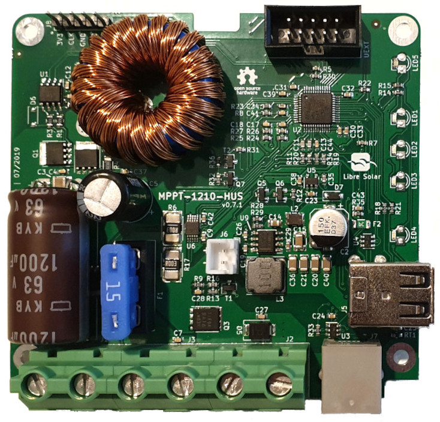

# 10A MPPT Charge Controller with USB

## Features:

- 12V battery voltage
- 40V max. solar input (36 to 48-cell panels, ideally so-called 12V panels with 36 cells)
- 10A max. charge current
- 10A max. load output current
- Low-power 32bit ARM MCU (STM32L072)
- Expandable via Olimex Universal Extension Connector (UEXT) featuring
   I2C, Serial and SPI interface (e.g. used for display, WIFI communication, etc.)
- USB charging
- High-side load switching

## Built-in protection:

- Overvoltage
- Undervoltage
- Overcurrent
- PV short circuit
- PV reverse polarity
- Battery reverse polarity (destructive, fuse is blown)
